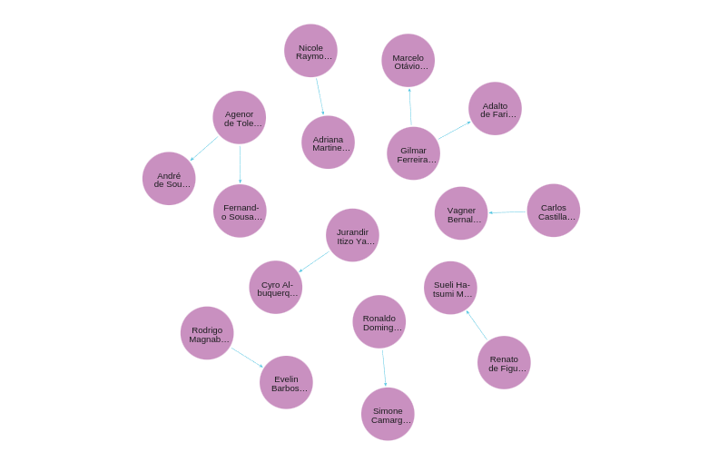

# Análise da genealogia acadêmica do corpo docente de instituições de ensino superior e seus respectivos impactos
Esta Iniciação Científica tem o foco do estudo das áreas e sub-áreas na genealogia acadêmica do corpo docente das instituições de ensino superior e seus respectivos impactos.
## 1. Preparação para a instalação
* Instale o [Python 3](https://www.python.org/downloads/) em seu computador
## 2. Criação do ambiente virtual
#### Clone este reposítorio para seu computador 
```
git clone https://github.com/PauloViniciusAF/GenealogiaAcademia-IC.git
```
#### Navegue até o diretório do repositório (utilize o cmd do computador)
```
cd GenealogiaAcademica-IC
```
### Crie o ambiente virtual com o comando 
```
python3 -m venv venv
```
### Ative o ambiente virtual 
* Windows
```
venv\Scripts\activate
```
* Linux/Mac
```
source venv/bin/activate
```
## 3. Instalação das bibliotecas necessárias
### Instale as dependências do projeto utilizando o arquivo requirements.txt
```
pip install -r requirements.txt
```
### Instale as bibliotecas do playwright
```
playwright install 
```
## 4. Preparação do Banco de Dados
* Para a execução do programa, é necessário ter uma conta em [Neo4j](https://neo4j.com/)
* Após acessar a sua conta, crie uma Instância (o site libera somente uma instância no plano free)
* Com a conexão a instância feita, crie um novo arquivo no diretório do projeto com o nome ".env"
* Utilize o código abaixo para colocar no arquivo ".env": 
```
URL_LATTES="http://lattes.cnpq.br/"
URL_LATTES_10="http://buscatextual.cnpq.br/buscatextual/visualizacv.do?id="
URL_PREVIEW_LATTES="http://buscatextual.cnpq.br/buscatextual/preview.do?metodo=apresentar&id="
NEO4J_URI="{URI_NEO4J}"
NEO4J_USER="{USER_NEO4J}"
NEO4J_PASSWORD={SENHA_NEO4J}"
```
* Altere os espaços {URI_NEO4J}, {USER_NEO4J} e {SENHA_NEO4J} correspondente ao seu banco de dados.

## 5. Preparação dos pesquisadores
* Crie um arquivo .list no diretório do repositório com o id e nome completo dos pesquisadores que serão analisados
* Um exemplo fictício pode ser encontrado na pasta Exemplo/exemplo-docentes.list
## 6. Execução do programa
* Antes de executar, verifique se os arquivos .list têm somente os dados necessários
* ATENÇÃO: Tenha ciência que, se tiver um grande número de pesquisadores, o programa pode custar bastante tempo
### Utilize o comando 
```
python3 main.py
```
## 7. Análise dos dados
* Após o programa terminar de rodar, acesse a query Banco de Dados, e utilize o comando
```
  MATCH p=()-[]->() RETURN p LIMIT 10;
```
* Para ver todos os dados do banco, mude o valor do limite para a quantidade de nós do grafo.
#### Exemplo de grafo com somente 10 nós

#### Exemplo de grafo com todos os nós 

